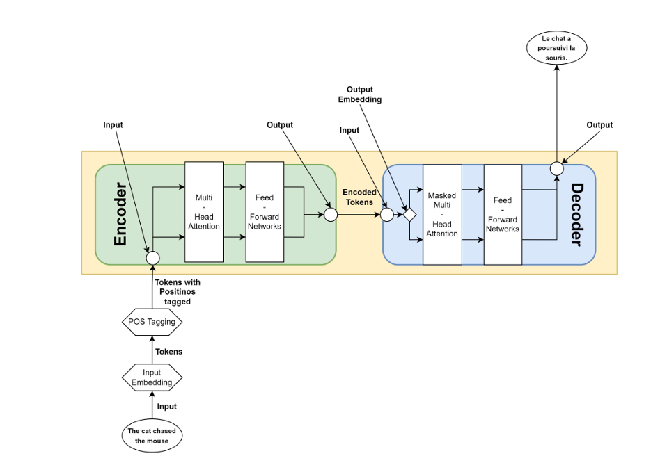

### Transformer

A neural architecture that uses self-attention to model relationships in sequences without recurrence.

#### Architecture (high level)

Stacked encoder & decoder blocks; each block = multi-head self-attention → add & norm → position-wise feed-forward → add & norm; positional encodings inject order.

#### Input → Output (flow)

Tokenize → embed → add positional encodings

Encoder: repeated self-attention + FF to produce encoded representations

Decoder: masked self-attention → encoder–decoder attention → FF to produce logits

Linear + softmax → output token probabilities → greedy/beam decode.

#### # Recurrence (Old Models) vs Seq (Transformers)

| Aspect              | Recurrence (RNN/LSTM/GRU)                       | Seq (Transformer)                                  |
|---------------------|-------------------------------------------------|---------------------------------------------------|
| Processing          | Sequential (word by word, step by step)         | Parallel (all tokens processed at once)           |
| Dependency Handling | Struggles with long-term dependencies           | Captures long-range dependencies via attention    |
| Training Speed      | Slow (cannot parallelize easily)                | Fast (highly parallelizable on GPUs/TPUs)         |
| Memory              | Remembers context through hidden states         | Remembers via self-attention across full sequence |
| Bottleneck          | Vanishing/exploding gradients in long sequences | Computational cost of attention (quadratic in seq length) |
