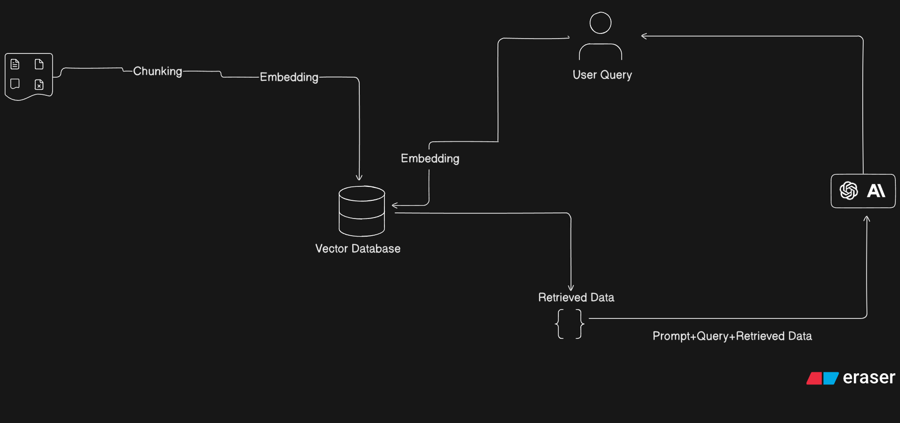
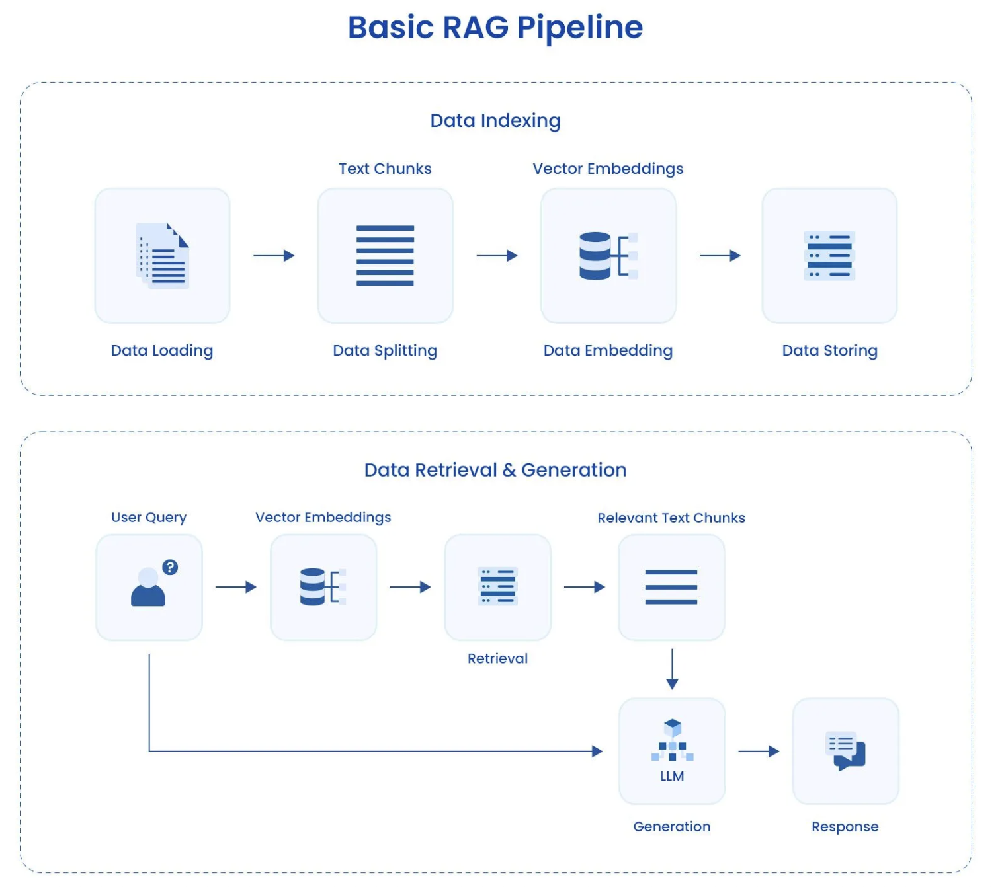

# 🚀 LangChain + RAG (Retrieval-Augmented Generation)

## 🔹 What is RAG?
RAG combines **retrieval** (from a knowledge base/vector DB) with **generation** (using an LLM).  
It helps LLMs answer queries using **external knowledge** instead of relying only on their training data.

---

## 🔹 LangChain + RAG Workflow

1. **Data Ingestion**  
   - Load documents (PDFs, CSVs, text, etc.)  
   - Split into smaller chunks  

2. **Embedding & Storage**  
   - Convert text chunks into vector embeddings  
   - Store in a **Vector Database** (FAISS, Pinecone, Weaviate, etc.)  

3. **Retrieval**  
   - User query is embedded  
   - Similar embeddings retrieved from vector DB  

4. **Augmented Generation**  
   - Combine **Query + Retrieved Context**  
   - Pass to LLM (via LangChain prompt templates)  
   - LLM generates context-aware response  

---

## 🔹 Visuals

### 1. High-Level LangChain + RAG Flow

---

### 2. Basic RAG Pipeline

---

## 🔹 Why LangChain + RAG?
- ✅ Overcomes LLM hallucination  
- ✅ Allows **domain-specific knowledge** injection  
- ✅ Scales with custom/private datasets  
- ✅ Provides explainability (retrieved sources)

---
